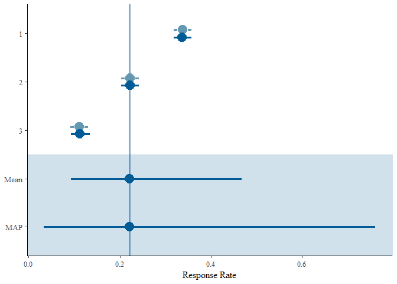

Example of reading & writing to ARD
================

This is an example of:

  - selecting (i.e. a query) from an analysis results database an
    endpoint from three clinical studies for the PBO arm,
  - generating a historical control,
  - writing the estimates from the MAP prior back to the ARD database.

## Set up

Load the required packages and path to a CSV file containing the
analysis dataset using a mock data model.

TODO: The model is not yet broken down by entity-relationship.

``` r
library(knitr)
library(tidyverse)
#> ── Attaching packages ───────────────────────────────────────────────────────────────────────────────── tidyverse 1.2.1 ──
#> ✔ ggplot2 3.1.0     ✔ purrr   0.2.4
#> ✔ tibble  2.1.3     ✔ dplyr   0.8.3
#> ✔ tidyr   0.8.0     ✔ stringr 1.3.0
#> ✔ readr   1.1.1     ✔ forcats 0.3.0
#> ── Conflicts ──────────────────────────────────────────────────────────────────────────────────── tidyverse_conflicts() ──
#> ✖ dplyr::filter() masks stats::filter()
#> ✖ dplyr::lag()    masks stats::lag()
library(RBesT)
#> Loading required package: Rcpp
#> This is RBesT version 1.3.3
library(RSQLite)  ## require an updated version fix column order bug when appending 
library(DBI)
path_to_data <- "./data/ARD-example.csv"
ARD <- read.csv(path_to_data)
```

## Load dataset in to SQL database

Use RSQLite as a proof of concent.

Note: need to update the version of RSQlite to address an issue with
column ordering when appending back to the database.

First step, set up sqlite database.

``` r
mydb <- dbConnect(RSQLite::SQLite(), "my-db.sqlite")
dbDisconnect(mydb)
unlink("my-db.sqlite")
mydb <- dbConnect(RSQLite::SQLite(), "")
dbDisconnect(mydb)
```

Insert the analysis result data.frame as a table in the database. This
table has a lot of duplication that can be simplified by fully modelling
the entity-relationships.

``` r
mydb <- dbConnect(RSQLite::SQLite(), "")
dbWriteTable(mydb, "ARD", ARD)
```

Display the column names in the table as a sanity check.

``` r
dbListTables(mydb)
#> [1] "ARD"
```

Also display the first five rows of the new ARD table.

``` r
dbGetQuery(mydb, 'SELECT * FROM ARD LIMIT 5')
#>   UANALID STUDYID ANALID ANALFLG    TRTVAR TRTVAL SUBVAR SUBVAL AVISTN
#> 1     1.1       1      1     FAS treatment  COMBO     NA     NA    EOS
#> 2     1.1       1      1     FAS treatment  COMBO     NA     NA    EOS
#> 3     1.1       1      1     FAS treatment  COMBO     NA     NA    EOS
#> 4     1.2       1      2     FAS treatment    PBO     NA     NA    EOS
#> 5     1.2       1      2     FAS treatment    PBO     NA     NA    EOS
#>                                    PARAM PARAMCD ROWCAT1    ANALTYP1
#> 1 Primary composite outcome: CVD or FHFH     PCE      NA DESCRIPTIVE
#> 2 Primary composite outcome: CVD or FHFH     PCE      NA DESCRIPTIVE
#> 3 Primary composite outcome: CVD or FHFH     PCE      NA DESCRIPTIVE
#> 4 Primary composite outcome: CVD or FHFH     PCE      NA DESCRIPTIVE
#> 5 Primary composite outcome: CVD or FHFH     PCE      NA DESCRIPTIVE
#>   ANALTYP2    STAT STATVAL   ANALMETH
#> 1       NA       N  2340.0      count
#> 2       NA       n   770.0      count
#> 3       NA percent    32.9 percentage
#> 4       NA       N  2340.0      count
#> 5       NA       n   791.0      count
#>                                                     ANALDESCRIPTION
#> 1             N: Total number of patients included in the analysis.
#> 2 n: Total number of patients with events included in the analysis.
#> 3                                                                  
#> 4             N: Total number of patients included in the analysis.
#> 5 n: Total number of patients with events included in the analysis.
```

## Query the database

Now we can query database.

We want to query for studies that have:

  - an outcome “PCE” which is short for “Primary composite endpoint”,
  - the analysis is “descriptive” (ANALYTYP1 = DESCRIPTIVE“”),
  - and a placebo treatment arm (TRTVAL = PBO),
  - return the selected data and write to dataframe,
  - and transform ready for RBesT,
  - display a glimpse of the df structure to ensure this
worked.

<!-- end list -->

``` r
df <- dbGetQuery(mydb, 'SELECT STUDYID, TRTVAL, STAT, STATVAL FROM ARD WHERE PARAMCD = "PCE" AND ANALTYP1 = "DESCRIPTIVE" AND TRTVAL = "PBO" ') %>%
  group_by(STUDYID, TRTVAL, STAT) %>%
   mutate(id = row_number()) %>% 
   gather(groupname, value, -id, -STUDYID, -TRTVAL, -STAT) %>%
   spread(STAT, value) %>%
   select(TRTVAL, N, n) %>%  
   glimpse()
#> Adding missing grouping variables: `STUDYID`
#> Observations: 3
#> Variables: 4
#> Groups: STUDYID, TRTVAL [3]
#> $ STUDYID <int> 1, 2, 3
#> $ TRTVAL  <chr> "PBO", "PBO", "PBO"
#> $ N       <dbl> 2340, 1800, 900
#> $ n       <dbl> 791, 400, 100
```

## MAP prior of three studies using RBesT

We run the placebo arm through RBest to generate a MAP prior. Note: we
are just using the default settings without any thought to make sure the
data is in the correct format.

``` r
set.seed(34563)
map_mcmc <- gMAP(cbind(n, N-n) ~ 1 | STUDYID,
                 data=df,
                 tau.dist="HalfNormal",
                 tau.prior=1,
                 beta.prior=2,
                 family=binomial)
#> Assuming default prior location   for beta: 0
```

Print the output of the model.

``` r
print(map_mcmc)
#> Generalized Meta Analytic Predictive Prior Analysis
#> 
#> Call:  gMAP(formula = cbind(n, N - n) ~ 1 | STUDYID, family = binomial, 
#>     data = df, tau.dist = "HalfNormal", tau.prior = 1, beta.prior = 2)
#> 
#> Exchangeability tau strata: 1 
#> Prediction tau stratum    : 1 
#> Maximal Rhat              : 1 
#> 
#> Between-trial heterogeneity of tau prediction stratum
#>  mean    sd  2.5%   50% 97.5% 
#> 0.897 0.400 0.376 0.805 1.890 
#> 
#> MAP Prior MCMC sample
#>   mean     sd   2.5%    50%  97.5% 
#> 0.2650 0.1820 0.0315 0.2220 0.7520
```

Check that a graphical representation of model checks is available

``` r
pl <- plot(map_mcmc)
```

Check that a number of plots are immediately defined

``` r
names(pl)
#> [1] "densityThetaStar"     "densityThetaStarLink" "forest_model"
```

Display the forest plot with model estimates

``` r
print(pl$forest_model)
```

<!-- -->

## Arrange data and write back to the db

Now we need to arrange the data into a format that can be inserted back
in to the database.

To do so we:

  - Map the output to datatable ARD schema (NOTE: this is very manual at
    the moment),
  - gather the statistics from the three mcmc chains into seperate
    analyes
  - give each analysis its own unique id
  - indicate that the analysis comes from three rather than one study.

<!-- end list -->

``` r
map <- as_tibble(map_mcmc$theta.strat) %>%
  mutate(
    ANALID = row_number(),
    STUDYID = "123",
    UANALID = paste0(STUDYID, ".", ANALID),
    ANALFLG = "FAS",
    TRTVAR = "treatment",
    TRTVAL = "PBO",
    SUBVAR = "",
    SUBVAL = "",
    AVISTN = "EOS",
    ANALMETH = "MAP prior",
    PARAM   = "Primary composite outcome: CVD or FHFH",
    PARAMCD = "PCE",
    ROWCAT1 = "ROWCAT1",
    ANALTYP1 = "PREDICTIVE",
    ANALTYP2 = "",
    ANALDESCRIPTION = "RBesT MAP Prior PBO from study 1, 2 and 3"
  ) %>%
  gather(
    "STAT",
    "STATVAL",-UANALID,
    -STUDYID,
    -ANALID,
    -ANALFLG,
    -TRTVAR,
    -TRTVAL,
    -SUBVAR,
    -SUBVAL,
    -AVISTN,
    -PARAM,
    -PARAMCD,
    -ROWCAT1,
    -ANALTYP1,
    -ANALTYP2,
    -ANALMETH,
    -ANALDESCRIPTION
  ) %>%
  glimpse()
#> Observations: 12
#> Variables: 18
#> $ ANALID          <int> 1, 2, 3, 1, 2, 3, 1, 2, 3, 1, 2, 3
#> $ STUDYID         <chr> "123", "123", "123", "123", "123", "123", "123",…
#> $ UANALID         <chr> "123.1", "123.2", "123.3", "123.1", "123.2", "12…
#> $ ANALFLG         <chr> "FAS", "FAS", "FAS", "FAS", "FAS", "FAS", "FAS",…
#> $ TRTVAR          <chr> "treatment", "treatment", "treatment", "treatmen…
#> $ TRTVAL          <chr> "PBO", "PBO", "PBO", "PBO", "PBO", "PBO", "PBO",…
#> $ SUBVAR          <chr> "", "", "", "", "", "", "", "", "", "", "", ""
#> $ SUBVAL          <chr> "", "", "", "", "", "", "", "", "", "", "", ""
#> $ AVISTN          <chr> "EOS", "EOS", "EOS", "EOS", "EOS", "EOS", "EOS",…
#> $ ANALMETH        <chr> "MAP prior", "MAP prior", "MAP prior", "MAP prio…
#> $ PARAM           <chr> "Primary composite outcome: CVD or FHFH", "Prima…
#> $ PARAMCD         <chr> "PCE", "PCE", "PCE", "PCE", "PCE", "PCE", "PCE",…
#> $ ROWCAT1         <chr> "ROWCAT1", "ROWCAT1", "ROWCAT1", "ROWCAT1", "ROW…
#> $ ANALTYP1        <chr> "PREDICTIVE", "PREDICTIVE", "PREDICTIVE", "PREDI…
#> $ ANALTYP2        <chr> "", "", "", "", "", "", "", "", "", "", "", ""
#> $ ANALDESCRIPTION <chr> "RBesT MAP Prior PBO from study 1, 2 and 3", "RB…
#> $ STAT            <chr> "mean", "mean", "mean", "se", "se", "se", "2.5%"…
#> $ STATVAL         <dbl> -0.6720669, -1.2527630, -2.0794415, -4.6177009, …
```

Check that the data.frame maps to the ARD schema by displaying the
columns in table ARD.

``` r
dbListFields(mydb, "ARD") 
#>  [1] "UANALID"         "STUDYID"         "ANALID"         
#>  [4] "ANALFLG"         "TRTVAR"          "TRTVAL"         
#>  [7] "SUBVAR"          "SUBVAL"          "AVISTN"         
#> [10] "PARAM"           "PARAMCD"         "ROWCAT1"        
#> [13] "ANALTYP1"        "ANALTYP2"        "STAT"           
#> [16] "STATVAL"         "ANALMETH"        "ANALDESCRIPTION"
```

## Append to database

Now we write back to the database appending to the table.

``` r
dbWriteTable(mydb, "ARD", map, append = TRUE)
```

We then check that the data from the new analysis is
there.

``` r
dbGetQuery(mydb, 'SELECT * FROM ARD WHERE PARAMCD = "PCE" AND ANALTYP1 = "PREDICTIVE" AND TRTVAL = "PBO" ')
#>    UANALID STUDYID ANALID ANALFLG    TRTVAR TRTVAL SUBVAR SUBVAL AVISTN
#> 1    123.1     123      1     FAS treatment    PBO                  EOS
#> 2    123.2     123      2     FAS treatment    PBO                  EOS
#> 3    123.3     123      3     FAS treatment    PBO                  EOS
#> 4    123.1     123      1     FAS treatment    PBO                  EOS
#> 5    123.2     123      2     FAS treatment    PBO                  EOS
#> 6    123.3     123      3     FAS treatment    PBO                  EOS
#> 7    123.1     123      1     FAS treatment    PBO                  EOS
#> 8    123.2     123      2     FAS treatment    PBO                  EOS
#> 9    123.3     123      3     FAS treatment    PBO                  EOS
#> 10   123.1     123      1     FAS treatment    PBO                  EOS
#> 11   123.2     123      2     FAS treatment    PBO                  EOS
#> 12   123.3     123      3     FAS treatment    PBO                  EOS
#>                                     PARAM PARAMCD ROWCAT1   ANALTYP1
#> 1  Primary composite outcome: CVD or FHFH     PCE ROWCAT1 PREDICTIVE
#> 2  Primary composite outcome: CVD or FHFH     PCE ROWCAT1 PREDICTIVE
#> 3  Primary composite outcome: CVD or FHFH     PCE ROWCAT1 PREDICTIVE
#> 4  Primary composite outcome: CVD or FHFH     PCE ROWCAT1 PREDICTIVE
#> 5  Primary composite outcome: CVD or FHFH     PCE ROWCAT1 PREDICTIVE
#> 6  Primary composite outcome: CVD or FHFH     PCE ROWCAT1 PREDICTIVE
#> 7  Primary composite outcome: CVD or FHFH     PCE ROWCAT1 PREDICTIVE
#> 8  Primary composite outcome: CVD or FHFH     PCE ROWCAT1 PREDICTIVE
#> 9  Primary composite outcome: CVD or FHFH     PCE ROWCAT1 PREDICTIVE
#> 10 Primary composite outcome: CVD or FHFH     PCE ROWCAT1 PREDICTIVE
#> 11 Primary composite outcome: CVD or FHFH     PCE ROWCAT1 PREDICTIVE
#> 12 Primary composite outcome: CVD or FHFH     PCE ROWCAT1 PREDICTIVE
#>    ANALTYP2  STAT    STATVAL  ANALMETH
#> 1            mean -0.6720669 MAP prior
#> 2            mean -1.2527630 MAP prior
#> 3            mean -2.0794415 MAP prior
#> 4              se -4.6177009 MAP prior
#> 5              se -4.6156195 MAP prior
#> 6              se -4.5481703 MAP prior
#> 7            2.5% -0.7589839 MAP prior
#> 8            2.5% -1.3663904 MAP prior
#> 9            2.5% -2.2975852 MAP prior
#> 10          97.5% -0.5857623 MAP prior
#> 11          97.5% -1.1409261 MAP prior
#> 12          97.5% -1.8704945 MAP prior
#>                              ANALDESCRIPTION
#> 1  RBesT MAP Prior PBO from study 1, 2 and 3
#> 2  RBesT MAP Prior PBO from study 1, 2 and 3
#> 3  RBesT MAP Prior PBO from study 1, 2 and 3
#> 4  RBesT MAP Prior PBO from study 1, 2 and 3
#> 5  RBesT MAP Prior PBO from study 1, 2 and 3
#> 6  RBesT MAP Prior PBO from study 1, 2 and 3
#> 7  RBesT MAP Prior PBO from study 1, 2 and 3
#> 8  RBesT MAP Prior PBO from study 1, 2 and 3
#> 9  RBesT MAP Prior PBO from study 1, 2 and 3
#> 10 RBesT MAP Prior PBO from study 1, 2 and 3
#> 11 RBesT MAP Prior PBO from study 1, 2 and 3
#> 12 RBesT MAP Prior PBO from study 1, 2 and 3
```

Disconnect the database.

``` r
dbDisconnect(mydb)
```

## Session info

``` r
sessionInfo()
#> R version 3.4.3 (2017-11-30)
#> Platform: x86_64-pc-linux-gnu (64-bit)
#> Running under: OpenShift Enterprise
#> 
#> Matrix products: default
#> BLAS/LAPACK: /CHBS/apps/busdev_apps/eb/software/imkl/2018.1.163-GCC-6.4.0-2.28/compilers_and_libraries_2018.1.163/linux/mkl/lib/intel64_lin/libmkl_gf_lp64.so
#> 
#> locale:
#>  [1] LC_CTYPE=en_US.UTF-8       LC_NUMERIC=C              
#>  [3] LC_TIME=en_US.UTF-8        LC_COLLATE=en_US.UTF-8    
#>  [5] LC_MONETARY=en_US.UTF-8    LC_MESSAGES=en_US.UTF-8   
#>  [7] LC_PAPER=en_US.UTF-8       LC_NAME=C                 
#>  [9] LC_ADDRESS=C               LC_TELEPHONE=C            
#> [11] LC_MEASUREMENT=en_US.UTF-8 LC_IDENTIFICATION=C       
#> 
#> attached base packages:
#> [1] stats     graphics  grDevices utils     datasets  methods   base     
#> 
#> other attached packages:
#>  [1] DBI_1.0.0       RSQLite_2.1.2   RBesT_1.3-3     Rcpp_1.0.2     
#>  [5] forcats_0.3.0   stringr_1.3.0   dplyr_0.8.3     purrr_0.2.4    
#>  [9] readr_1.1.1     tidyr_0.8.0     tibble_2.1.3    ggplot2_3.1.0  
#> [13] tidyverse_1.2.1 knitr_1.20     
#> 
#> loaded via a namespace (and not attached):
#>  [1] lubridate_1.7.3      mvtnorm_1.0-8        lattice_0.20-35     
#>  [4] utf8_1.1.3           zeallot_0.1.0        assertthat_0.2.0    
#>  [7] digest_0.6.15        psych_1.7.8          R6_2.2.2            
#> [10] cellranger_1.1.0     plyr_1.8.4           backports_1.1.2     
#> [13] stats4_3.4.3         evaluate_0.10.1      httr_1.3.1          
#> [16] BiocInstaller_1.28.0 pillar_1.4.2         rlang_0.4.0         
#> [19] lazyeval_0.2.1       readxl_1.0.0         rstudioapi_0.7      
#> [22] blob_1.2.0           checkmate_1.8.5      rmarkdown_1.11      
#> [25] labeling_0.3         foreign_0.8-69       bit_1.1-14          
#> [28] munsell_0.5.0        broom_0.4.3          compiler_3.4.3      
#> [31] modelr_0.1.1         rstan_2.17.3         pkgconfig_2.0.1     
#> [34] mnormt_1.5-5         htmltools_0.3.6      tidyselect_0.2.5    
#> [37] gridExtra_2.3        codetools_0.2-15     fansi_0.4.0         
#> [40] crayon_1.3.4         withr_2.1.2          grid_3.4.3          
#> [43] nlme_3.1-131.1       jsonlite_1.5         gtable_0.2.0        
#> [46] magrittr_1.5         StanHeaders_2.17.2   scales_1.0.0        
#> [49] cli_1.0.0            stringi_1.1.7        reshape2_1.4.3      
#> [52] xml2_1.2.0           vctrs_0.2.0          Formula_1.2-2       
#> [55] tools_3.4.3          bit64_0.9-7          glue_1.3.1          
#> [58] hms_0.4.2            parallel_3.4.3       yaml_2.1.19         
#> [61] inline_0.3.14        colorspace_1.3-2     bayesplot_1.4.0     
#> [64] rvest_0.3.2          memoise_1.1.0        haven_2.1.1
```
